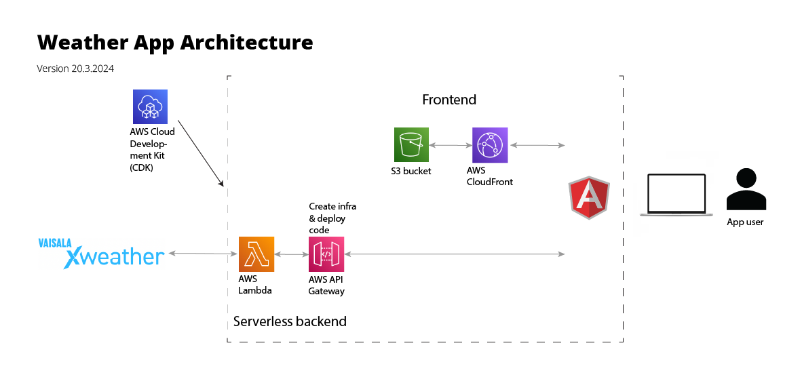

# Location weather service
A simple weather app backend (PoC, not a full functional app) using Vaisala XWeather API, AWS CDK, Lambda, Api Gateway and Secrets Manager. In this app, the weather data is not transformed, and the only real advantage of fetching the weather data in the backend is keeping the API keys secure (stored in AWS Secrets manager).

The related frontend repo is at https://github.com/mikkokotola/weatherfront.

## Architecture

Note that the frontend is in another repo.

## Setup and requirements
- Aerisweather API (Vaisala XWeather) requires registration, see https://www.xweather.com/account.
- Aerisweather credentials need to be stored in AWS SecretsManager. The app will read them from there. Region: `eu-north-1`, secret name `aerisweather`, and secret values `aerisweather_id` and `aerisweather_secret`. The cred fetching code is in `./lib/credsProvider.ts`.

## Tech stack
- All code in Typescript
- AWS CDK to define the needed AWS infrastructure
- AWS SAM to run Lambdas locally
- Aerisweather API (from Vaisala) to fetch the weather data

## Useful commands
### Run and deploy
* `npm run build`   compile typescript to js
* `npm run watch`   watch for changes and compile
* `npm run test`    perform the jest unit tests
* `npx cdk deploy`  deploy this stack to your default AWS account/region
* `npx cdk diff`    compare deployed stack with current state
* `npx cdk synth`   emits the synthesized CloudFormation template

### Invoke Lambda locally using AWS SAM
Requirements: AWS SAM CLI installed.

* `npx cdk synth`   Emit the synthesized CloudFormation template
* `sam local invoke getCurrentWeatherFunction --event ./events/get-current-weather-event-tampere.json -t ./cdk.out/XweatherStack.template.json`  Invoke the get current weather lambda function locally using SAM.

## Notes
- Tests runnable but no tests implemented
